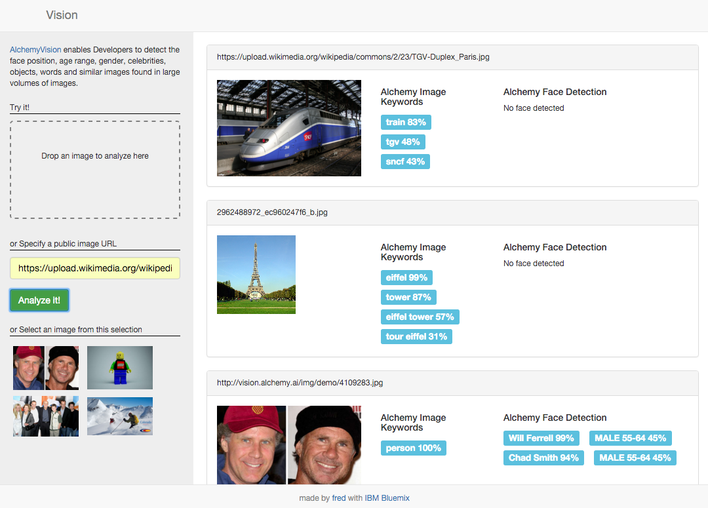

# Java™ Vision - sample Java web application using the Alchemy Vision API for image tagging and face detection

This projects shows how to use the Alchemy Vision API in a Java application.

[](https://bluemix.net/deploy)

  

## Overview

 Built using IBM Bluemix, the application uses:
  * [Liberty for Java™](https://www.ng.bluemix.net/docs/starters/liberty/index.html)
  * [Alchemy Vision](https://console.ng.bluemix.net/catalog/services/alchemy_api) through the
  [Watson Developer Cloud Java SDK](http://watson-developer-cloud.github.io/java-sdk/)
  
## Running the app on Bluemix

1. [Sign up for Bluemix][bluemix_signup_url] or use your existing account.

1. Download and install the [Cloud-foundry CLI][cloud_foundry_url] tool

1. Clone the app to your local environment from your terminal using the following command

  ```
  $ git clone https://github.com/l2fprod/java-vision.git
  ```

1. `cd` into this newly created directory

1. Build the application WAR file with Maven:

  ```
  mvn package
  ```
  
  The command generates the WAR in *target/java-vision.war*.
  
1. Connect to Bluemix in the command line tool and follow the prompts to log in.
  ```
  $ cf api https://api.ng.bluemix.net
  $ cf login
  ```
  **Note**: The services in the following steps may produce warnings when you create them, alerting you that they are not entirely free.
  Creating and trying this app leaves you well within the limits of your free quota, however, always remain cognizant of your monthly service usage.

1. Create the Cloudant service in Bluemix.

  ```
  $ cf create-service alchemy_api free vision-alchemy
  ```

1. Push your app to Bluemix

  ```
  $ cf push
  ```

And voila! You now have your very own instance of the application running on Bluemix.

## Running the app locally

The following instructions assume you are using [Eclipse IDE for Java EE developers](http://www.eclipse.org/downloads/)
and Websphere Application Server Liberty Profile Developer Tools for Mars.

1. To run the application locally, follow [Step 1](https://github.com/IBM-Bluemix/local-liberty-tutorial/blob/master/docs/001-IMPORT-SOURCE.md)
and [Step 2](https://github.com/IBM-Bluemix/local-liberty-tutorial/blob/master/docs/002-LIBERTY.md)
from this [other tutorial](https://github.com/IBM-Bluemix/local-liberty-tutorial) to get the code into your Eclipse environment.

1. Add an environment variable named **ALCHEMY_API_KEY** with your Alchemy API key in the server environment (server.env in Liberty).
You can retrieve the Alchemy API key from the Bluemix console.

1. Add the **java-vision** projet to Liberty profile.

1. Start the Liberty server.

## Code Structure

### Back-end

| File | Description |
| ---- | ----------- |
|[**Analysis.java**](src/main/java/net/bluemix/tutorial/vision/Analysis.java)|Implements /api/analysis/image and /api/analysis/url endpoints by calling the Alchemy Vision API|

### Front-end

| File | Description |
| ---- | ----------- |
|[**index.html**](src/main/webapp/index.html)|User interface to drop images or specify URLs|
|[**vision.js**](src/main/webapp/js/vision.js)|Captures the drag and drop or URL specification and calls the server API|

## Troubleshooting

The primary source of debugging information for your Bluemix app is the logs.
To see them, run the following command using the Cloud Foundry CLI:

  ```
  $ cf logs java-vision --recent
  ```
  
For more detailed information on troubleshooting your application, see the [Troubleshooting section](https://www.ng.bluemix.net/docs/troubleshoot/tr.html) in the Bluemix documentation.

## License

See [License.txt](License.txt) for license information.

## Privacy Notice
This application includes code to track deployments to IBM Bluemix and other Cloud Foundry platforms.
The following information is sent to a [Deployment Tracker](https://github.com/IBM-Bluemix/cf-deployment-tracker-service)
service on each deployment:

* Application Name (application_name)
* Space ID (space_id)
* Application Version (application_version)
* Application URIs (application_uris)

This data is collected from the VCAP_APPLICATION environment variable in IBM Bluemix and other Cloud Foundry platforms. This data is used by IBM to track metrics around deployments of sample applications to IBM Bluemix. Only deployments of sample applications that include code to ping the Deployment Tracker service will be tracked.

## Disabling Deployment Tracking

To disable deployment tracking remove cf-java-app-tracker-client dependencies from the pom.xml.

[bluemix_signup_url]: https://console.ng.bluemix.net/?cm_mmc=GitHubReadMe-_-BluemixSampleApp-_-Node-_-Workflow
[cloud_foundry_url]: https://github.com/cloudfoundry/cli
